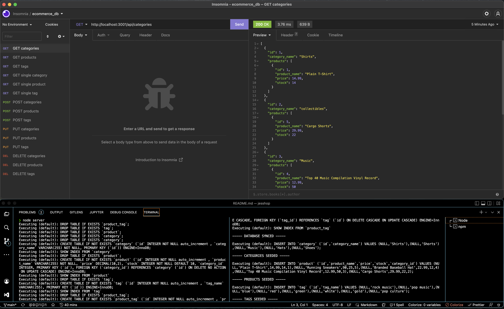

# jesshop

## Table of Contents
* [Description](#description)
* [Built With](#languages)
* [Installation](#installation)
* [Contributing](#contributing)
* [Usage](#usage)
* [Questions](#questions)
* [Application Preview](#application-preview)

    
       

## [Description](#table-of-contents)
An e-commerce backend with category, product, and tag database information.

## [Languages](#table-of-contents)
JavaScript, MySQL, Express.js API, and Sequelize

## [License](#table-of-contents)
The application is covered under the following license: 
 
    [MIT](https://choosealicense.com/licenses/MIT)
      
      

## [Usage](#table-of-contents)
Allows management to keep track of ecommerce data such as product information (pricing, stock etc.), categories, and tags. Database can be added to and altered. 

## [Contributing](#table-of-contents)

Thank you for your interest in contributing to this project, however I am currently not accepting third party contributions.
      

## [Installation](#table-of-contents)
* `git clone git@github.com:jessica-calderon/jesshop.git` 
* `node server` 
* `npm run seed`

## [Application Preview](#table-of-contents)
Click the image to see the recorded walkthrough demo.

 
<a href="https://drive.google.com/file/d/1Jf67DUFVmV1mvrI1z5k8d1vWgiZ31pDC/view" alt='walkthrough video link' target='_blank'>Walkthrough Video</a>
## [Questions](#table-of-contents)
Questions? Please contact me at the following links:  
[GitHub](https://github.com/jessica-calderon)  
[Email: calderonjessica13@yahoo.com](mailto:calderonjessica13@yahoo.com)
